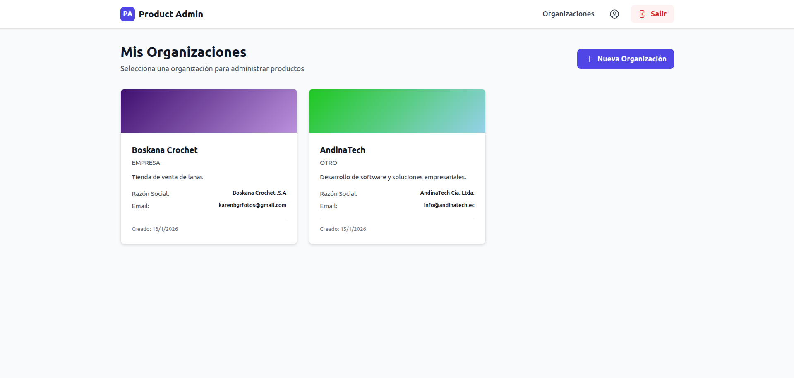
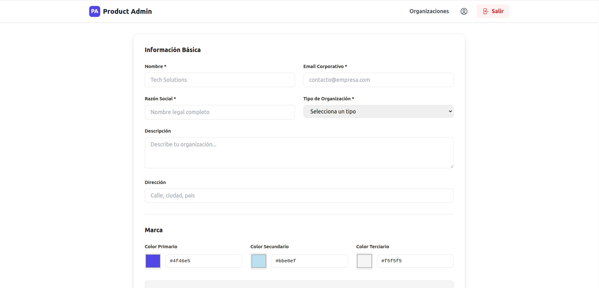
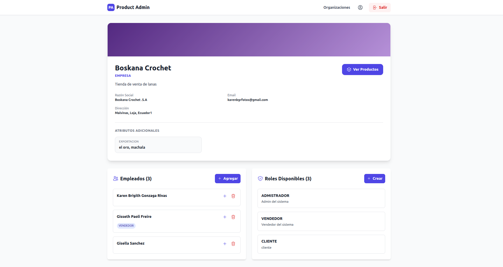
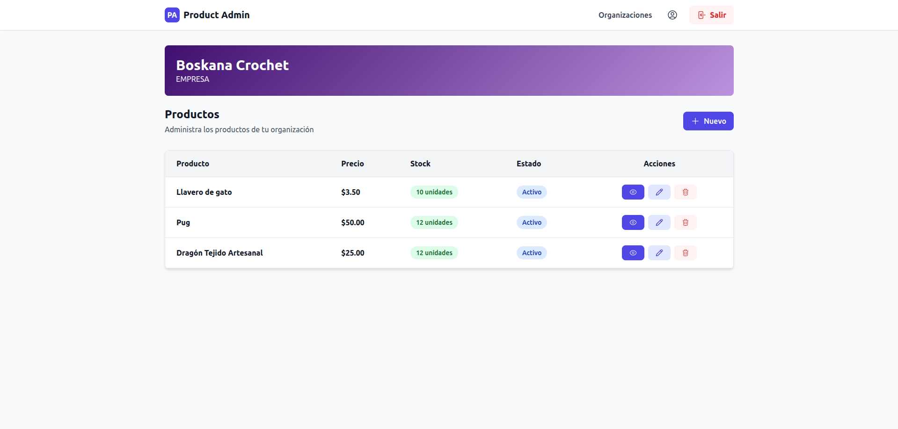
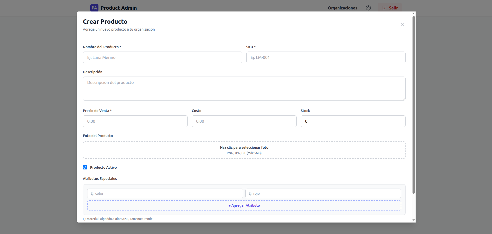

# Product Admin - Frontend

Aplicación web moderna para administración de productos y organizaciones. Construida con Next.js 14, TypeScript y Tailwind CSS.

## Características

- **Dashboard Intuitivo**: Panel de control para gestionar organizaciones
- **Gestión de Organizaciones**: Crear, editar y eliminar organizaciones con branding personalizado
- **Gestión de Empleados**: Agregar empleados y asignar roles
- **Sistema de Roles**: Crear y gestionar roles organizacionales
- **Catálogo de Productos**: CRUD completo de productos con atributos personalizados
- **Autenticación JWT**: Login y registro seguros
- **Diseño Responsivo**: UI/UX moderna con Tailwind CSS y Heroicons
- **TypeScript**: Tipado fuerte para mayor seguridad

## Requisitos Previos

- Node.js 18+
- npm o yarn
- Navegador moderno
- Backend de Product Admin ejecutándose en `http://localhost:6543`

## Instalación

### 1. Clonar el repositorio

```bash
git clone https://github.com/KBGR55/product-admin-frontend.git
cd product-admin-frontend
```

### 2. Instalar dependencias

```bash
npm install
# o
yarn install
```

### 3. Configurar variables de entorno

Crear archivo `.env.local`:

```env
NEXT_PUBLIC_API_URL=http://localhost:6543
```

### 4. Ejecutar en desarrollo

```bash
npm run dev
# o
yarn dev
```

Abre [http://localhost:3000](http://localhost:3000) en tu navegador.

## Estructura del Proyecto

```
src/
├── app/
│   ├── api/
│   │   └── upload/                 # Endpoints API (upload de imágenes)
│   ├── auth/
│   │   ├── login/                  # Página de login
│   │   └── register/               # Página de registro
│   ├── components/
│   │   ├── auth/
│   │   │   ├── LoginForm.tsx       # Formulario de login
│   │   │   └── RegisterForm.tsx    # Formulario de registro
│   │   ├── Navbar.tsx              # Barra de navegación
│   │   ├── FormProductModal.tsx    # Modal para crear/editar productos
│   │   └── ProductDetailModal.tsx  # Modal de detalles de producto
│   ├── organizations/
│   │   ├── page.tsx                # Dashboard de organizaciones
│   │   ├── form/
│   │   │   ├── page.tsx            # Formulario crear organización
│   │   │   └── [orgId]/page.tsx    # Formulario editar organización
│   │   ├── [id]/
│   │   │   ├── page.tsx            # Detalles de organización
│   │   │   └── products/page.tsx   # Catálogo de productos
│   ├── layout.tsx                  # Layout principal
│   ├── globals.css                 # Estilos globales
│   └── page.tsx                    # Página de inicio
├── types/
│   ├── auth.ts                     # Tipos de autenticación
│   ├── organization.ts             # Tipos de organizaciones
│   ├── product.ts                  # Tipos de productos
│   └── api.ts                      # Tipos de respuestas API
├── utilities/
│   └── api.ts                      # Cliente HTTP y utilidades
└── fonts/
    ├── GeistVF.woff
    └── GeistMonoVF.woff
```

## Pantallas Principales

### Dashboard de Organizaciones

- Visualización de todas las organizaciones del usuario
- Tarjetas con información de cada organización
- Botones para editar y eliminar
- Opción para crear nueva organización

### Formulario de Organización

- Información básica (nombre, email, razón social, tipo)
- Descripción y dirección
- Selección de colores de marca (primario, secundario, terciario)
- Atributos especiales personalizados
- Vista previa de colores en tiempo real

### Detalles de Organización

- Header con gradiente de colores personalizados
- Información de la organización
- Gestión de empleados con asignación de roles
- Gestión de roles organizacionales
- Atributos adicionales

### Catálogo de Productos

- Lista de productos con grid responsive
- Información de precios y stock
- Búsqueda y filtrado
- Acciones para editar y eliminar
- Modal para crear/editar productos

### Formulario de Producto

- Nombre, descripción, SKU
- Precios (venta y costo) y stock
- Upload de foto del producto
- Atributos personalizados (color, tamaño, material, etc.)
- Estado activo/inactivo

## Flujo de Autenticación

1. **Registro**: El usuario se registra con email y contraseña
2. **Login**: Autenticación con JWT
3. **Token**: Se almacena en localStorage
4. **Protección**: Las rutas están protegidas y requieren token válido

```
[Login/Register] → [Token JWT] → [Almacenar en localStorage] → [Acceso a Dashboard]
```

## Tecnologías Utilizadas

### Framework & Lenguaje
- **Next.js 14**: Framework React con app router
- **TypeScript**: Tipado estático
- **React 18**: Librería UI

### Estilos
- **Tailwind CSS**: Framework de estilos utilitarios
- **Heroicons**: Iconos SVG de alta calidad

### Utilidades
- **fetch API**: Llamadas HTTP
- **localStorage**: Persistencia de tokens

## Dependencias Principales

```json
{
  "next": "^14.0.0",
  "react": "^18.0.0",
  "typescript": "^5.0.0",
  "tailwindcss": "^3.0.0",
  "@heroicons/react": "^2.0.0"
}
```

## Build para Producción

```bash
npm run build
npm run start
```

## Variables de Entorno

| Variable | Descripción | Ejemplo |
|----------|-------------|---------|
| `NEXT_PUBLIC_API_URL` | URL del backend | `http://localhost:6543` |

## Integración con Backend

El frontend se comunica con el backend mediante:

- **Endpoints**: REST API en `http://localhost:6543/api`
- **Autenticación**: JWT en header `Authorization: Bearer <token>`
- **CORS**: Configurado en backend

## Rutas Principales

| Ruta | Descripción |
|------|-------------|
| `/` | Página de inicio |
| `/auth/login` | Login |
| `/auth/register` | Registro |
| `/organizations` | Dashboard de organizaciones |
| `/organizations/form` | Crear organización |
| `/organizations/form/[orgId]` | Editar organización |
| `/organizations/[id]` | Detalles de organización |
| `/organizations/[id]/products` | Catálogo de productos |

## Contribuir

1. Fork el proyecto
2. Crea una rama (`git checkout -b feature/AmazingFeature`)
3. Commit cambios (`git commit -m 'Add AmazingFeature'`)
4. Push a rama (`git push origin feature/AmazingFeature`)
5. Abre un Pull Request

## Licencia

Este proyecto está bajo la licencia MIT.

## 🔗 Enlaces Relacionados

- [Backend Repository](https://github.com/KBGR55/product-admin-backend)
- [Documentación Next.js](https://nextjs.org/docs)
- [Tailwind CSS](https://tailwindcss.com/)
- [TypeScript](https://www.typescriptlang.org/)

## Pasos Siguientes

- [ ] Agregar pruebas unitarias
- [ ] Implementar caché de datos
- [ ] Agregar paginación en listados
- [ ] Mejorar manejo de errores
- [ ] Agregar temas oscuro/claro
- [ ] Implementar notificaciones toast
- [ ] Agregar exportación de datos

---

⭐ Si te fue útil, considera dar una estrella en GitHub!